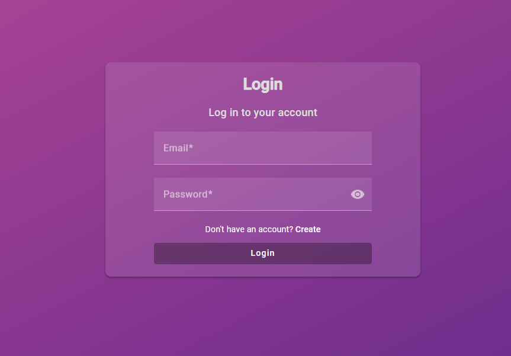
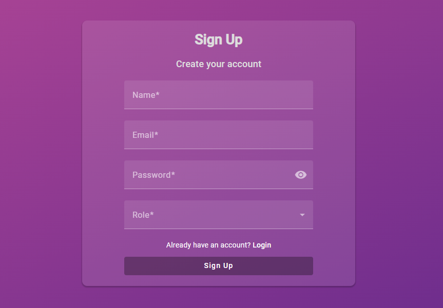
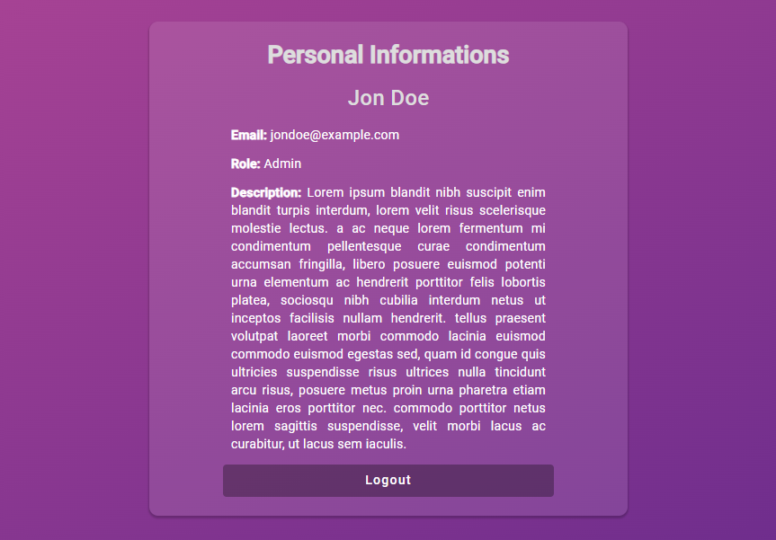
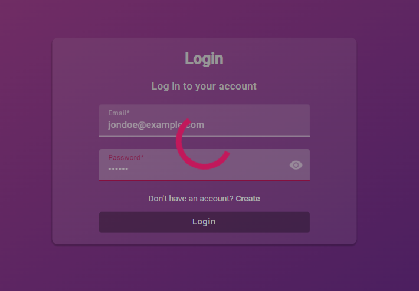

# Login Page Authenticator Angular


Este projeto é um autenticador de login com foco na parte frontend e utilização da blibioteca JSON Server Auth para as requests do backend.







## Features

- [x] Interface amigável com a utilização do Material UI do Angular.
- [x] Responsividade para diferentes dispositivos.
- [x] Validações da obrigatoriedade do preenchimento completo dos formulários.
- [x] Validações para formato de e-mail.
- [x] Possibilidade de criar novo usuário.
- [x] Interceptor de loading para enquanto estiver ocorrendo requests não ser possível alterar dados na tela.
- [x] Logins realizados com armazenamento do JWT no Local Storage.
- [x] Snackbars laterais com mensagens de sucesso e erro em todas as requests.
- [x] Interceptor de autorização para rotas restritas redirecionando para o login caso acesso negado.
- [x] Opção de logout excluindo dados da Local Storage.
- [x] Senha com a possibilidade de ser mascarada ou visível, dependendo da preferência do usuário.

## Pré-requisitos

Para rodar esse projeto localmente, é importante ter instalado:

- Node.js
- npm (Node Package Manager)

## Começando

- Clone o repositório na sua máquina:

```bash
git clone https://github.com/DaniOrze/login-page-authentication-angular.git
```

- Navegue até a pasta do projeto:

```bash
cd login-page-authentication-angular
```
### Rodando o Front-end

- Instale as dependências:

```bash
npm install
```

- Rode a aplicação:

```bash
ng serve
```

A aplicação irá rodar no seu navegador padrão em: `http://localhost:4200`

### Rodando o Back-end

- Em um terminal em paralelo rode a aplicação back-end:

```bash
npx json-server db.json -m ./node_modules/json-server-auth/
```
A aplicação irá rodar no seu navegador padrão em: `http://localhost:3000`


## Contribuições

Contribuições são bem-vindas! Caso encontre algum ponto a ser melhorado ou sugestões, abra uma issue ou mande um pull request para o repositório.

## Licença

Este projeto está licenciado pelo MIT.
