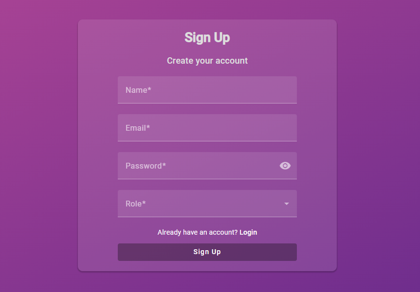
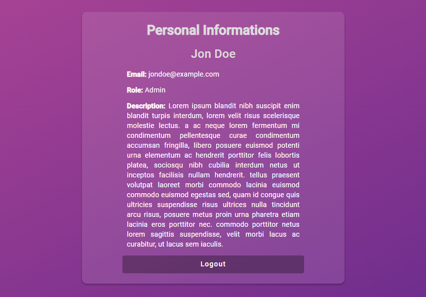

# Login Page Authenticator Angular


If you prefer to read in Brazilian Portuguese, please, click [here](./README-ptbr.md).

This project is a login authenticator with a focus on the frontend, utilizing the JSON Server Auth library for backend requests.






## Features

- [x] User-friendly interface using Angular's Material UI.
- [x] Responsive for different devices.
- [x] Mandatory completion validations for the forms.
- [x] Validations for email format.
- [x] Ability to create a new user.
- [x] Loading interceptor to prevent data alteration on the screen during ongoing requests.
- [x] Logins performed with JWT storage in Local Storage.
- [x] Side snackbars displaying success and error messages for all requests.
- [x] Authorization interceptor for restricted routes, redirecting to the login page in case of denied access.
- [x] Logout option that clears data from Local Storage.
- [x] Password field with the possibility to show or mask the password based on user preference.

## Prerequisites

To run this project locally, is important to have the following installed:

- Node.js
- npm (Node Package Manager)

## Getting Started

- Clone the repository to your local machine:

```bash
git clone https://github.com/DaniOrze/login-page-authentication-angular.git
```

- Navigate to the project's directory:

```bash
cd login-page-authentication-angular
```
### Starting the Front-end

- Install the dependencies:

```bash
npm install
```

- Start the application:

```bash
ng serve
```

This will launch in: `http://localhost:4200`

### Starting the Back-end

- In a separate terminal, run the backend application:

```bash
npx json-server db.json -m ./node_modules/json-server-auth/
```
This will launch in: `http://localhost:3000`


## Contribute

Contributions are welcome! If you come across any areas for improvement or have suggestions, please open an issue or submit a pull request to the repository.

## License

This project is licensed under the MIT License.
